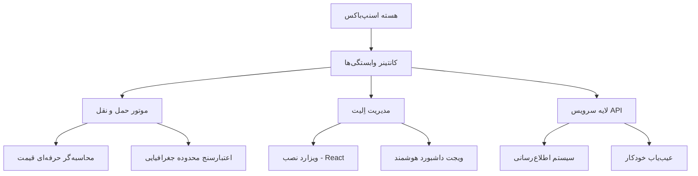

# 🚚 اسنپ‌باکس اِلیت (SnappBox Elite) v1.3.1

**اسنپ‌باکس اِلیت** برترین و حرفه‌ای‌ترین راهکار ارسال کالا برای فروشگاه‌های ووکامرس است. این افزونه با بازنویسی کامل بر پایه معماری مدرن، امنیت بالا و سرعت خیره‌کننده، فرآیند ارسال سفارشات شما را به یک موتور هوشمند و تمام‌خودکار تبدیل می‌کند.

---

## 🏛️ معماری سازمانی
این افزونه از معماری **سرویس‌گرا (SOA)** استفاده می‌کند و تمامی وابستگی‌ها توسط کانتینر حرفه‌ای **PHP-DI** مدیریت می‌شوند. این ساختار باعث پایداری دائمی و قابلیت توسعه نامحدود پروژه می‌گردد.

---

## ✨ قابلیت‌های کلیدی اِلیت

### 🚀 هسته فوق‌سریع و مدرن
- **استاندارد PSR-4**: بارگذاری خودکار و بهینه کلس‌ها بدون اتلاف منابع.
- **تایپینگ سخت‌گیرانه**: کدنویسی با امنیت بالا و کمترین خطای زمان اجرا.
- **مدیریت وابستگی مدرن**: استفاده از بهترین ابزارهای مهندسی نرم‌افزار.

### 🎨 تجربه کاربری پریمیوم
- **ویزارد نصب React**: راه اندازی سریع و لذت‌بخش در چند ثانیه.
- **Vite Build System**: لود بسیار سریع فایل‌های JS و CSS.
- **داشبورد هوشمند**: مشاهده آنی موجودی کیف پول و اخبار مهم.

### 🛡️ امنیت و عیب‌یابی سازمانی
- **سیستم لاگینگ PSR-3**: ثبت دقیق تمامی رویدادها برای رفع مشکل سریع.
- **ابزار HealthCheck**: مانیتورینگ ۲۴ ساعته اتصال به سرور و سلامت سیستم.
- **اعتبارسنجی جفرافیایی**: نمایش نرخ ارسال فقط به مشتریان داخل محدوده قانونی.

---

## 🏎️ مجموعه ابزارهای اتوماسیون (Elite Command Suite)
محیط توسعه اسنپ‌باکس اِلیت به یک موتور خودکار قدرتمند مجهز شده است. برای مطالعه دقیق نحوه کارکرد این ابزارها، [راهنمای اتوماسیون](AUTOMATION-FA.md) را مطالعه کنید.

دستورات اصلی:
- **`/sync-api`**: مانیتورینگ هوشمند مستندات اسنپ‌باکس و آپدیت خودکار کدها.
- **`/debug`**: اسکن عمیق، عیب‌یابی و خود-ترمیمی (Self-Healing).
- **`/audit`**: بازرسی کامل امنیتی و عملکردی.
- **`/factory`**: تولید خودکار کدهای زیرساختی و رابط کاربری.

---

## 🚀 نصب و راه‌اندازی

### برای مدیران فروشگاه
۱. آخرین نسخه را از بخش [Releases](https://github.com/m4tinbeigi-official/SnappBox/releases) دانلود کنید.
۲. فایل ZIP را در بخش افزونه‌های وردپرس آپلود و فعال کنید.
۳. مراحل را از طریق **ویزارد نصب هوشمند** دنبال کنید.

---

## 📄 لایسنس
این افزونه تحت لایسنس GPL-2.0 منتشر شده است.

---
*ساخته شده با ❤️ برای کسب‌وکارهای حرفه‌ای.*
