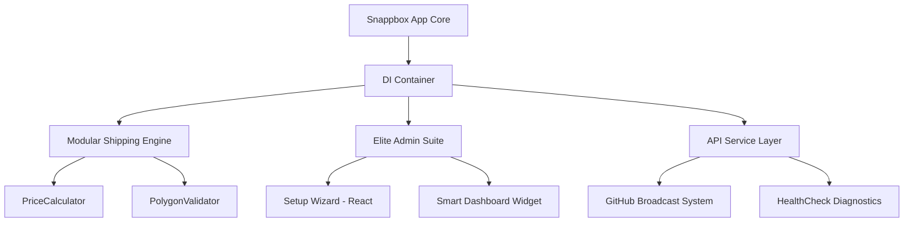

# 🚚 SnappBox Elite v1.3.1

[](README-FA.md)
[](https://wordpress.org)
[](https://woocommerce.com)
[](https://php.net)
[](https://vitejs.dev)
[](https://reactjs.org)
[](LICENSE)

**SnappBox Elite** is the definitive enterprise-grade shipping integration for WooCommerce. Completely refactored for performance, security, and scalability, it transforms the standard delivery workflow into a professional, automated shipping engine.

---

## 🏛️ Enterprise Architecture

The plugin follows a modern **Service-Oriented Architecture (SOA)** with a centralized **Dependency Injection (DI)** container.



---

## ✨ Key Elite Features

### 🚀 High-Performance Core
- **100% PSR-4 Compliant**: No more legacy `require_once`. Autoloading at its finest.
- **Strict Typing**: Built with `declare(strict_types=1);` for maximum reliability.
- **DI Container**: Robust dependency management via `php-di`.

### 🎨 Premium UI/UX
- **React Setup Wizard**: A standalone mini-app for a seamless onboarding experience.
- **Vite Build System**: Ultra-fast asset delivery and modern TypeScript support.
- **Smart Dashboard Widget**: Real-time wallet balance and remote broadcast messages.

### 🛡️ Enterprise Diagnostics
- **PSR-3 Logger**: Professional logging into the WooCommerce system.
- **HealthCheck Tool**: Real-time monitoring of API connectivity and system status.
- **Elite Notices**: High-contrast, beautifully styled administrative alerts.

---

## 🛠️ Developer Ecosystem

### Modular Integration
All core logic is decoupled into stand-alone services located in `includes/Core`, `includes/WooCommerce`, and `includes/API`.

### Automated Release Pipeline (CI/CD)
The project utilizes **GitHub Actions** to automatically generate production-ready ZIP releases on every push to the `main` branch.

### Command-Line Workflows
We provide custom agent workflows for rapid development:
- `push`: Automated build, lint, and GitHub synchronization.
- `readme`: Automated synchronization of this documentation.

---

## 🚀 Installation & Setup

### For Users
1. Download the latest `snappbox-elite.zip` from the [Releases](https://github.com/m4tinbeigi-official/SnappBox/releases) section.
2. Upload to your WordPress plugins directory.
3. Activate and follow the **Quick Setup Wizard**.

### For Developers
1. Clone the repository.
2. Install PHP and JS dependencies:
   ```bash
   composer install
   npm install
   ```
3. Run the development environment:
   ```bash
   npm run dev
   ```
4. Build for production:
   ```bash
   npm run build
   ```

---

## 📄 License
This plugin is licensed under the GPL-2.0 License.

---
*Built with ❤️ for professional merchants.*
